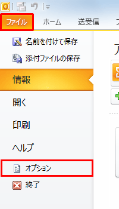
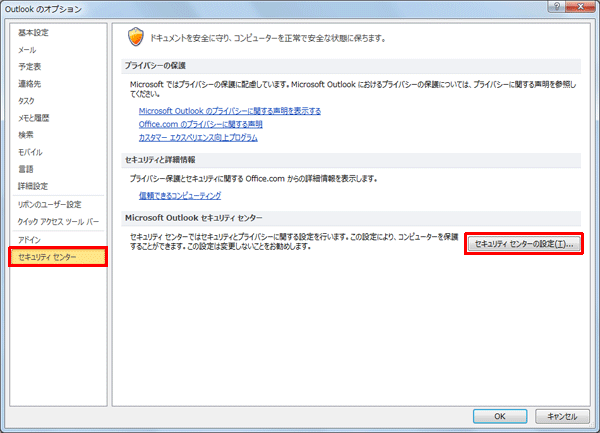
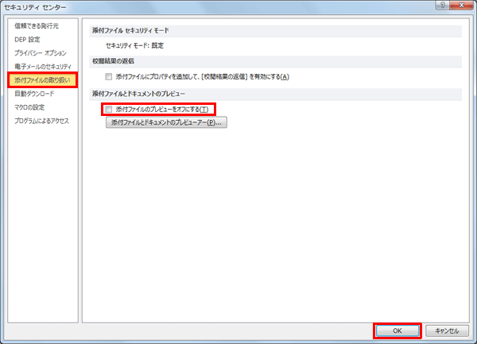

# outlookの添付メールプレビューをOFFにする方法

outlookの添付メールは、ファイルを選択すると自動的にプレビューされてしまいます。
セキュリティ上、よろしくない為、自動プレビューをOFFにする方法を記載します。

1. outlookのオプションを選択

   

2. オプション画面の左項目、「セキュリティセンター」の「セキュリティセンターの設定」を選択

   

3. セキュリティセンター設定画面の「添付ファイルの取り扱い」を選択し、
最下にある「添付ファイルのプレビューをオフにする」にチェックを入れます。

   

以上です。
